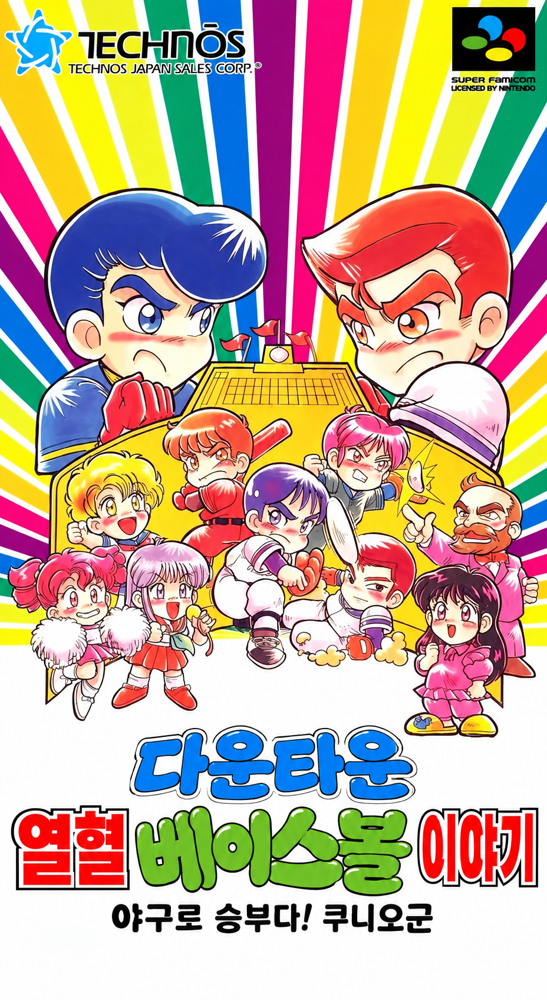

# 다운타운 열혈 베이스볼 이야기 한글화 (Kunio Baseball Korean)

<p align="center">
  
</p>

**현재 버전: v0.5.7 (장면 그래픽 압축 해제 이식, 병실·부실 장소 제목 추가)**

슈퍼패미컴용 **다운타운 열혈 베이스볼 이야기 ~야구로 승부다! 쿠니오군~**
(ダウンタウン熱血べーすぼーる物語 野球で勝負だ! くにおくん, Technos Japan, 1993)을
한글화하는 프로젝트입니다.

## 게임 소개

열혈고교의 쿠니오와 하나조노고교의 리키를 비롯한 쿠니오군 시리즈의 낯익은 얼굴들이
이번에는 야구로 맞붙습니다. 겉모습은 야구 게임이지만 속은 여전히 쿠니오군입니다.
타자와 주자가 몸싸움을 벌이고, 투수는 공이 사라지거나 휘어지는 필살 마구를 던지며,
타자는 필살 타법으로 외야 담장 너머로 공을 날려 보냅니다.

- 라이벌 학교들을 차례로 꺾어 나가는 **스토리 모드**
- 좋아하는 팀을 골라 친구와 겨루는 **대전 모드**
- 선수마다 다른 능력치와 필살기, 그리고 시리즈 특유의 코믹한 연출

일본에서만 발매되어 국내에서는 정식으로 접할 기회가 없었던 작품입니다.
스토리 모드의 대사와 메뉴, 선수 이름 등 게임 안의 일본어를 모두 한글로 옮겨,
쿠니오군 시리즈를 좋아하는 분들이 편하게 즐길 수 있도록 하는 것이 목표입니다.

## 대상 롬

| 항목 | 값 |
|------|----|
| 파일명 | `Downtown Nekketsu Baseball Monogatari - Yakyuu de Shoubu da! Kunio-kun (Japan).sfc` |
| 크기 | 1,572,864 바이트 (12 Mbit, 헤더 없음) |
| 매핑 | LoROM, FastROM |
| SRAM | 8 KB |
| MD5 | `42e27da8a2b91eca749d9700ebccd865` |
| SHA-1 | `f7b89946f22f1e8b6c4ee8094f0c212ab78ed22a` |

이 저장소에는 게임 롬을 포함하지 않습니다. 배포되는 것은 원본 롬에 적용하는 패치와
번역 데이터, 빌드 도구뿐입니다. 위 해시와 일치하는 롬을 직접 준비해야 합니다.

## 버전과 진행도

v1.0을 "게임에 등장하는 모든 글자가 한글이고, 처음부터 끝까지 실제 플레이로 검증된 정식판"으로 잡았습니다.

| 버전 | 내용 | 상태 |
|------|------|------|
| v0.1 | 롬 구조 분석. 폰트·텍스트 위치, 텍스트 출력 루틴 파악. 헤드리스 에뮬레이터 검증 환경 구축 | 완료 |
| v0.2 | 한글 폰트(Galmuri11) 삽입, 대사 출력 루틴을 가변폭 16px 렌더러로 교체, 문자열 인코딩·빌드 도구 | 완료 |
| v0.3 | 메뉴·팀 이름 등 미리 그려진 라벨의 한글 출력 (행 기록기 후킹 + 타일 풀), 라벨 97개 추출·85개 번역 | 완료 |
| **v0.4** | 스토리 대사 694개, 선수·심판 이름 400여 개(가나 자동 음역), 아이템·학교 이름 1차 번역 | 완료 |
| v0.5 | 경기 중 텍스트(중계 창, HUD 이름, 투구·타격 메뉴)의 한글화. 경기 전용 8x8 한글 폰트(Galmuri7)와 동적 타일 캐시 | 완료 |
| v0.5.1 | 데이터 위치를 못 찾은 화면(VS 제목, 경기 전 세로 메뉴, 팀 선택 격자)을 16x16 글리프 교체(이미지 번역)로 처리 | 완료 |
| v0.5.2 | 경기 화면 BG2 그래픽 문자: 점수판(회·초·말, 팀 약칭), 성적 오버레이, 배너(플레이 볼·아웃·홈런 …) | 완료 |
| v0.5.3 | 경기 전 로스터 화면(선발멤버·타순·수비 변경, 선수정보): 8x8 가나 이름·수비 위치·취소/결정을 한글로 | 완료 |
| v0.5.4 | VRAM 쓰기 큐 훅으로 선수정보 상세(능력치·장비) 204행 한글화, 다음 상대 화면·학교 이름의 16x16 글리프 교체 | 완료 |
| v0.5.5 | 스토리 장면의 장소 제목(열혈고교, 니지가오카2초메)과 1장 타이틀 카드를 압축 해제 버퍼 훅·타일셋 재작성으로 한글화 | 완료 |
| v0.5.6 | 경기 중 타임 메뉴(선수 교대·수비 교대·아이템 사용·선수 정보·응원)와 그 선수 목록 한글화 | 완료 |
| v0.5.7 | 장면 그래픽 압축 해제 루틴을 파이썬으로 이식해 모든 장면 시트를 오프라인 추출, 병실(리카의 병실)·부실·등장 제목 글리프 추가 | 완료 |
| v0.5.8 | 이닝 교대 점수판 장면(장면 번호 `0x7E`)의 학교 이름 글리프 확인과 감독 이름 26행 한글화, 시트 서명 검색 속도 개선 | 완료 |
| v0.5.9 | 글자 간격 통일: 다음 상대 화면·경기 전 세로 메뉴·타임 메뉴·팀 선택 격자를 글리프 교체 대신 라벨 풀(비례 폰트)로 출력, 8x16 숫자·괄호 글리프 보호 | 완료 |
| v0.5.10 | 초반 검수 반영: 경기 화면 그래픽 깨짐(표식 오인) 수정, 팀 선택 격자 이름을 16px로 확대, 응원 하위 메뉴 [기합]/[야유], 니지가오카2초메 제목 비례 배치 | 완료 |
| **v0.6** | 타이틀 로고 한글화: 다운타운 열혈 야구 이야기 / 야구로 승부다! 쿠니오군 | 완료 |
| v0.6 | 신문 기사 표제 등 남은 그림 문자, 전체 플레이 검증과 번역 다듬기, 타이틀 로고 | 예정 |
| v1.0 | 전 구간 검증 완료 정식판 | 예정 |

### 지금 한글로 나오는 것 (v0.5)

| 항목 | 상태 |
|------|------|
| 스토리 대사, 메뉴 안내 메시지 (스토리 테이블 694개) | 새 렌더러로 출력. 번역이 비어 있으면 원문(가나)을 같은 폰트로 출력 |
| 대사 속 선수·학교·아이템 이름 (변수 치환) | 새 렌더러로 출력 |
| 메인 메뉴, 일시정지 메뉴, 팀 선택, VS 화면의 라벨과 팀 이름 | 라벨 후킹으로 한글 출력 (`translations/labels.csv`) |
| 대사 속 숫자, 라벨 속 숫자 | 원본 8x8 숫자 타일 유지 |
| VS 화면 제목(열혈야구대회·제 n 회전·대), 선수정보의 아군/적군 | 16x16 한자 글리프를 한글 음절로 교체 (`kanji16.KOREAN16`; 음절 1개 = 글리프 1개인 곳만) |
| 경기 전 세로 메뉴(선발 멤버 변경·타순 변경·수비 변경·선수 정보), 타임 메뉴 항목 | VRAM 쓰기 큐로 가는 16x16 행을 라벨 풀로 출력 (`labels.csv`의 `que_` 행) |
| 연습 시합 팀 선택 격자의 팀 이름 (열혈·하나조노·호료 …) | 라벨 칸을 4칸에서 6칸으로 넓혀 16px 폰트로 가운데 정렬 (`labels.csv`의 `grid_` 행) |
| 토너먼트 화면 등 데이터 위치 미확인 라벨 | **일본어 원본 유지** |
| 경기 중 중계 창 (「 이건 파울 플라이. 등), HUD 선수 이름, 투구·타격 선택 메뉴 | 경기 전용 8x8 한글 폰트로 출력 (`translations/ingame.csv`) |
| 경기 중 점수판(1회초, 열 0-0 하), 성적 오버레이(방어율·투구수·타율·홈런·타수), 배너(스트라이크·볼·볼넷·타임·체인지·플레이 볼·콜드 게임·게임 셋·데드 볼·타격방해·아웃·포즈·세이프·파울·홈런) | BG2 4bpp 타일 재작성 (`translations/bg2.csv`) |
| 로스터 화면의 선수 이름(성·전체 이름), 아이템 이름, 수비 지시(맡긴다·전진 수비 …) | 메뉴 폰트의 가나 칸을 동적 8x8 캐시로 써서 한글 출력 |
| 로스터 화면의 수비 위치(투수(1) …), 취소/결정, 선수정보의 아군/적군 | 고정 8x8 슬롯·16x16 글리프 교체 (`translations/static8.csv`) |
| 선수정보 상세(포지션·타격·피칭·수비·어깨·다리·근성·장비·부상과 그 값) | VRAM 쓰기 큐 훅이 행 주소로 찾아 한글로 다시 그림 (`translations/rows8.csv`) |
| 스토리 모드 다음 상대 화면(다음 대전 상대, 이번 대회까지의 성적, 타율·방어율·본루타·도루·실책), 학교 전체 이름 | 압축 타일맵 안의 행을 업로드 직전에 라벨 풀로 다시 그림 (`labels.csv`의 `map_` 행), 학교 이름은 라벨 표 |
| 스토리 장면 상단의 장소 제목(열혈고교, 니지가오카2초메, 리카의 병실, 부실, 등장) | 장면 그래픽 압축 해제 버퍼를 DMA 직전에 훑어 글리프 타일을 한글 타일로 바꿈 (`translations/sprtext.csv`) |
| 스토리 1장 타이틀 카드(열혈고교 스토리 / 『스가타군의 연애근성 이야기』 편) | 비압축 타일셋의 글자 타일을 다시 그림 (`translations/titles.csv`) |
| 경기 중 타임 메뉴(투구 메뉴에서 START): 선수 교대·수비 교대·아이템 사용·선수 정보·응원, 선수 목록, 취소/결정 | 라벨 풀(`que_` 행) + 경기 중 8x8 캐시 |
| 이닝 교대 점수판 장면의 학교 이름(열혈고교 …)과 감독 이름(모모조노 사토미 …) | 학교 이름은 서명 교체 표, 감독 이름은 VRAM 쓰기 큐 훅 (`translations/rows8.csv`의 `q_02E7xx`) |
| 신문 기사 장면의 표제 그림 문자 | **일본어 원본 유지** |
| 타이틀 로고(다운타운 열혈 야구 이야기)와 부제(야구로 승부다! 쿠니오군) | 압축 시트의 타일과 BG2 타일맵, 스프라이트 사본을 모두 다시 그림 (`tools/kbb/titlelogo.py`) |
| 타이틀 화면의 "버튼을 눌러 주세요", 그림 문자 | **일본어 원본 유지** |

번역은 `translations/strings.csv`(대사)와 `translations/labels.csv`(라벨)의 `korean` 열에 적습니다.
대사 694줄, 아이템 34개, 학교 이름 26개, 선수·심판 이름 422개(`tools/kbb/kana2ko.py`로 가나를 자동 음역, 주요 인물은 수동 지정),
라벨 149개(팀 선택 격자 이름 13개 포함), 투구·타격 메뉴 항목 141개(`translations/ingame.csv`)가 1차 번역되어 있습니다. 성 테이블의 빈 항목 148개는 원본에서도 쓰이지 않는 자리입니다.

## 저장소 구성

```
Baseball/
├── README.md
├── 열혈.png                  # 패키지 이미지
├── tools/
│   ├── emu/harness.py        # 헤드리스 에뮬레이터 (스크린샷, 입력 스크립트, VRAM/WRAM 덤프)
│   ├── emu/snes9x_libretro.so
│   └── kbb/
│       ├── table.py          # 원본 8x8 폰트 문자 테이블과 제어 코드
│       ├── text.py           # 스크립트 포인터 테이블 해석, 문자열 추출 (CSV)
│       ├── font.py           # 원본 폰트 타일 읽기/쓰기, 참고용 폰트 시트 렌더링
│       ├── glyphs.py         # Galmuri11 BDF에서 16px 글리프 비트맵 생성
│       ├── encode.py         # 새 인코딩, 글리프 코드 배정, 줄바꿈 검사
│       ├── script.py         # 스크립트 뱅크 재구성 (테이블 12개)
│       ├── labels.py         # 미리 그려진 타일 행 라벨 추출 (CSV)
│       ├── kanji16.py        # 16x16 글리프 판독표
│       ├── font8.py          # 경기 전용 8x8 한글 폰트 블록 생성 (Galmuri7, 정적 음절 + 동적 풀)
│       ├── ingame.py         # 투구·타격 메뉴 레코드 추출·재인코딩 (CSV)
│       ├── bg2.py            # 경기 화면 BG2 그래픽 문자(점수판·오버레이·배너) 재작성
│       ├── static8.py        # 미리 그려진 8x8 행(수비 위치, 취소/결정)을 고정 슬롯 한글로 교체
│       ├── rows8.py          # 롬에서 곧바로 큐에 넣는 8x8 행(선수정보 상세) 추출과 훅 표 생성
│       ├── sprtext.py        # 스토리 장소 제목: 압축 해제 버퍼용 타일 서명·한글 타일 표
│       ├── lz.py             # 장면 그래픽 압축 해제($91:AB43) 이식과 명령 16 레코드 열거
│       ├── titlecard.py      # 챕터 타이틀 카드: 비압축 타일셋의 글자 타일 재작성
│       ├── build.py          # 롬 확장·패치·체크섬, 라벨 표식·예약 비트맵, 최종 롬 생성
│       ├── asm/text.s        # 한글 렌더러와 NMI 훅 (ca65)
│       ├── vramscan.py       # 세이브스테이트로 장면별 VRAM 타일 사용 분석
│       ├── dis65816.py       # 루틴 분석용 65816 디스어셈블러
│       └── fonts/            # Galmuri11.bdf, Galmuri7.bdf (OFL 1.1)
├── translations/strings.csv  # 대사: id, table, offset, length, japanese, korean
├── translations/labels.csv   # 라벨: id, bank, top, bottom, n, x, y, japanese, korean
├── translations/ingame.csv   # 투구·타격 메뉴: id, offset, japanese, korean
├── translations/bg2.csv      # 경기 화면 그래픽 문자: id, kind, tileset, target, japanese, korean
├── translations/roster.csv   # 수비 지시 문자열: id, japanese, korean
├── translations/static8.csv  # 미리 그려진 8x8 행: id, offset, n, japanese, korean
├── translations/rows8.csv    # 큐 훅 행: id, bank, addr, n, japanese, korean
├── translations/sprtext.csv  # 장소 제목 글리프: id, japanese, korean, tl, tr, bl, br(타일 서명 hex)
├── translations/titles.csv   # 타이틀 카드 행: id, japanese, korean, top, bottom(열별 타일 번호)
├── build/                    # 빌드 결과 (git 제외)
└── tests/                    # 도구 단위 테스트 (pytest)
```

빌드에는 cc65의 `ca65`/`ld65`가 필요합니다 (`apt install cc65`, 또는 압축을 푼 위치를 `CC65_BIN`으로 지정).

```bash
# 한글 롬 빌드 (번역은 translations/strings.csv에서 읽음)
CC65_BIN=/path/to/cc65/bin python3 -m tools.kbb.build ROM.sfc build/Kunio_Baseball_Korean.sfc
```

사용 예:

```bash
# 문자열 추출
python3 -m tools.kbb.text ROM.sfc translations/strings.csv

# 폰트 시트 렌더링 (8x8, 16x16)
python3 -m tools.kbb.font ROM.sfc font8.png font16.png

# 타이틀 화면까지 실행해 스크린샷과 VRAM 덤프
python3 tools/emu/harness.py ROM.sfc --frames 1500 --shot 1500:title.png --dump-vram vram.bin

# 출력 루틴 디스어셈블
python3 -m tools.kbb.dis65816 ROM.sfc 869D5 86B60

# 테스트
python3 -m pytest -q tests
```

## 기술 메모

### 폰트

- ROM `0x0B47E5`부터 `0x3000` 바이트, 2bpp 타일 768개. 그대로 VRAM `$0000`에 올라간다.
- 타일 `0x00`~`0xFF`: 8x8 텍스트 폰트. 열 단위로 가타카나(`_9`, `_A`, `_B`), 히라가나(`_D`, `_E`, `_F`),
  작은 가나와 문장부호(`_8`, `_C`), 숫자·알파벳(`_3`, `_4`, `_5`), 8x8 한자(`_1`, `_2`, `_6`, `_7`)가 배치되어 있다.
  탁점(`0x01`)과 반탁점(`0x11`)은 별도 타일이며, 글자 윗줄에 찍힌다.
- 타일 `0x100`~`0x2FF`: 16x16 한자·기호 128자. 16타일 폭 시트 배치(좌상 n, 우상 n+1, 좌하 n+0x10, 우하 n+0x11).
  메뉴와 능력치 화면에서 쓰인다.

### 스크립트

- 뱅크 `$06` (ROM `0x030000`~`0x037FFF`). 뱅크 첫머리에 포인터 테이블 12개의 주소 목록이 있고,
  각 테이블은 4바이트 항목(u16 주소 + u16 0)의 배열이며 바로 뒤에 문자열이 이어진다.
- 테이블 내용: 성(208), 이름 보조(1, 4), 이름 세트(13 x 5), 아이템(34), 스토리 대사(694), 성명(208),
  스태프(50), 학교 이름(13).
- 문자 1개 = 1바이트 (8x8 폰트 타일 번호). 제어 코드는 `00` 끝, `02` 공백, `A0` 줄바꿈,
  `D0 xx` 탁점+글자, `E0 xx` 반탁점+글자, `F0 xx` 변수 치환(선수 이름, 팀 이름, 아이템 등), `F3` 대기.

### 대사 출력 루틴 (`$10:E9D5`, ROM `0x0869D5`)

- 스토리 테이블(`$06:9A22`)에서 포인터를 읽어 1바이트씩 처리하고, 글자마다 `JSL $91ADA2`로
  타일맵 버퍼에 타일 번호(`| $2000`, 팔레트 0)를 쓴다. X는 글자마다 1칸, 줄바꿈 시 Y는 2칸 증가한다.
- 탁점·반탁점은 같은 X의 한 줄 위(Y-1)에 찍으므로, 한 줄의 대사가 실제로는 타일 2줄(16px)을 차지한다.
- 대사 창은 화면 아래 2줄(타일 행 23, 25), 1열부터 31열까지 폭 248px.

### 한글 렌더러 (v0.2, `tools/kbb/asm/text.s`)

- 롬을 2 MB로 확장하고 뱅크 `$30`에 새 스크립트 뱅크, `$31`에 렌더러 코드와 글리프 폭 테이블,
  `$32`부터 글리프 비트맵(글자당 32바이트, 16행 x 16비트)을 둔다.
- 원본 루틴의 패치 지점은 3곳이다. 메시지 시작(`$10:EA21`), 본문 루프 머리(`$10:EA2B`),
  변수 치환용 중첩 문자열 루프 머리(`$10:EBF7`). 대기, 변수 치환, 창 처리는 원본 코드를 그대로 쓴다.
- 글자는 가변폭(한글 12px, 라틴 4~9px)으로 WRAM 타일 버퍼(`$7E:8100`, 33열 x 4행 타일)에 그려지고,
  NMI 훅(`$00:FF0C` 벡터 교체)이 변경된 열만 DMA로 VRAM 캐시 영역에 올린다.
  캐시 타일 번호는 BG3 이름 베이스(`$7E:005C` 섀도)에 따라 `0x100`(베이스 `$A000`, 스토리 장면) 또는
  `0x300`(그 외)을 쓴다. 장면별 빈 타일은 `vramscan.py`로 확인했다.
- 단어 단위 줄바꿈을 실행 시점에 한다. 같은 문자열이 메뉴 창(폭 208px)과 대사 창(폭 248px)에서
  모두 쓰이기 때문이다. 명시적 줄바꿈(`\n`)도 그대로 적용되며, 2줄을 넘는 부분은 버린다.
- 새 인코딩: `00` 끝, `02` 공백, `A0` 줄바꿈, `F0 xx` 변수, `03`~`7F` 1바이트 글리프(빈도 상위 125자),
  `80`~`9F` + 1바이트 = 2바이트 글리프. 빌드 때마다 실제 사용 문자로 글리프 표를 새로 만든다.
- 정확도 높은 bsnes-mercury 코어에서도 Snes9x와 같은 결과를 확인했다.

### 라벨 출력 (v0.3, `asm/text.s`의 `kbb_label_row`)

- 메뉴 항목, 팀 이름, 화면 제목 같은 고정 텍스트는 타일 번호가 미리 나열된 "행 데이터"이며,
  모두 `$91B390`(X=열, Y=행, A=데이터 주소, 스택에 폭 n)을 통해 창 타일맵에 복사된다.
  16px 라벨은 윗줄(탁점 또는 16x16 글리프 위쪽)과 아랫줄 두 번의 호출로 그려진다.
- `labels.py`가 호출 지점 87곳과 레코드 목록(메인 메뉴 33, 일시정지 11, VS 화면 21)을 정적으로 해석해
  라벨 97개를 추출한다. 빌드는 번역된 라벨의 행 데이터 첫 워드를 표식(`$C000|번호` 윗줄, `$D000|번호` 아랫줄)으로
  덮어쓰고 나머지는 0으로 채운다. 원본 데이터에는 두 플립 비트가 모두 켜진 워드가 없어 충돌하지 않는다.
- `$91B390` 진입부를 후킹해 표식이 있으면 한글 문자열을 그린다. 글리프는 16x16 칸지 폰트 영역
  (타일 `0x100`~`0x2FF`, 512개)을 풀로 써서 타일 단위로 할당하고, NMI가 변경 범위만 VRAM에 올린다.
  라벨 번호별 캐시(64개)로 같은 라벨은 다시 그리지 않으며, 캐시 적중 시에도 타일을 다시 전송해
  장면이 폰트 블록을 다시 로드한 경우를 복구한다.
- 아직 번역하지 못한 화면이 쓰는 칸지 글리프(VS 화면 제목 등)는 빌드가 512비트 예약표로 넘겨 풀에서 제외하고,
  풀 이미지는 원본 칸지 타일로 초기화해 전송 범위에 끼어도 원본이 그대로 다시 올라가게 한다.
- 스토리 장면(BG3 베이스 `$A000`)에서는 대사 캐시 뒤의 124타일(`0x184`~`0x1FF`)만 풀로 쓴다.
- 한글 라벨은 원래 폭 n보다 최대 4열까지 넓게 그릴 수 있다. 빌드가 폭 초과를 경고한다.
  숫자가 게임에 의해 덧그려지는 라벨(이닝 수 등)은 공백으로 자리를 맞춘다.

### 경기 중 텍스트 (v0.5, `asm/text.s`의 `kbb_game_*`, `kbb_hud_name`)

- 경기 화면에서는 VRAM 64 KB가 배경 타일, 64x64 타일맵(`$E000`~`$FFFF`), 스프라이트로 모두 사용 중이라
  16px 글리프 캐시를 둘 자리가 없다. 그래서 경기 중 텍스트는 8x8 폰트 영역(`$C000`~`$CFFF`, 256타일)을
  **경기 전용 8x8 한글 폰트 블록**(ROM `0x19B000`)으로 교체하는 방식으로 처리한다. 폰트 블록은 명령 06 디스크립터 4곳과
  `0x0067D9`에서 로드되는데, 모두 새 블록을 가리키도록 패치한다.
- 블록 구성(`tools/kbb/font8.py`): 숫자·기호·`体`·회색 한자 등 게임이 직접 쓰는 타일은 유지(`KEEP`)하고,
  가나 자리 168칸을 비운다. 그중 96칸에는 투구·타격 메뉴에 나오는 음절을 Galmuri7로 렌더링해 고정 배치하고,
  나머지 72칸은 **동적 풀**로 남긴다. 메뉴 레코드(ROM `0x03708A`, 28바이트 × 141개, `tools/kbb/ingame.py`)는
  이 고정 타일 번호로 다시 인코딩한다.
- 중계 창은 원본 렌더러(`$04:CAF4`)의 문자 출력 부분을 후킹해(`kbb_game_start/main/nested`) 새 스크립트 뱅크의
  한글 문자열을 읽고, 음절마다 동적 풀에서 타일을 하나 배정한 뒤(`d_get`, 캐시 맵 `D_MAP`) 8x8 글리프(`$B3:8000` 테이블,
  16바이트/글리프)를 업로드 링으로 VRAM에 보내고 그 타일 번호를 원본과 같은 VRAM 쓰기 큐(`$80F0FD`)로 타일맵에 쓴다.
  큐는 NMI에서 DMA하므로 소스는 프레임이 끝날 때까지 살아 있어야 한다. 행 단위 스테이징과 고정 공백 워드(`G_BLANK`)를 쓰고,
  큐 호출 전후로 데이터 뱅크를 `$7E`로 맞춘다. 줄 폭은 22칸, 2줄이며 단어 단위로 줄을 바꾼다.
- HUD 선수 이름은 `$0E:F7B2`를 `kbb_hud_name`으로 돌려 성 테이블의 한글 문자열을 같은 동적 풀로 5칸에 채운다.
  풀이 72칸이라 중계 창과 HUD가 함께 써도 한 장면 안에서는 부족하지 않다(다 쓰면 가장 오래된 항목을 재사용).
- 점수판·성적 오버레이·배너는 BG3 폰트가 아니라 BG2 그래픽 타일이다(아래 v0.5.2 항목).
- 검증용으로 실행기에 `--poke FRAME:WRAM오프셋:바이트` 옵션을 추가했다. 경기 흐름은 번역 길이에 따라 프레임이 어긋나므로
  원본과 같은 입력으로도 같은 장면이 나오지 않는다. 메시지 요청 변수(`$7E:68F5`)를 직접 써서 재현하는 용도다.
- 렌더러 작업 영역은 게임이 쓰지 않는 WRAM에 둔다(`$7E:1400` 직접 페이지, `$7E:8800`/`$9000`/`$A400` 버퍼).
  이전 위치(`$7E:B200`~`$D2FF`)는 경기 중 화면 지우기의 0 채움 소스(`$7E:CF73`)와 겹쳐 경기 화면을 깨뜨렸다.
- 라벨 타일은 풀 이미지 없이 타일 단위 업로드 링(32개, NMI당 24개 전송)으로 VRAM에 올리고,
  캐시 적중 시 다시 그려 보낸다. 예약 칸지 타일과 겹쳐 전송되는 문제가 사라졌다.

### 16x16 글리프 교체 (v0.5.1, `kanji16.KOREAN16`; 격자 슬롯 방식은 v0.5.9에서 라벨 풀로 대체)

- VS 화면 제목(熱血野球大会 / 第n回戦 / 対)과 경기 전 세로 메뉴(先発メンバー変更 / 打順変更 / 守備変更 / 選手データ)는
  텍스트 데이터 위치를 찾지 못했다. 두 화면 모두 16x16 한자 글리프(타일 `0x100`~`0x2FF`)를 그대로 그리므로,
  글리프 비트맵 자체를 한글 음절로 바꿨다(`build.korean_kanji16`). 한자의 한국 한자음은 어디서 쓰여도 같으므로
  글리프 하나 = 음절 하나 대응이 안전하다(熱→열, 血→혈, 第→제 …). 판독표에서 火·小로 읽었던 글리프는 실제로는
  반각 쌍 メン·バー였고, デ 글리프는 デー다. 選手データ는 2글리프에 "데이터"를 넣을 수 없어 "선수정보"로 옮겼다.
- 연습 시합의 팀 선택 격자는 `$91:C48B`의 24바이트 레코드 13개(이름 x, 행, 레벨 표시 x, 행+1, 타일 워드 8개)로
  16x16 글리프 두 개짜리 팀 이름을 그린다. 훈독 이름(花園=하나조노)은 글자 대응이 불가능하고 칸도 4타일(32px)뿐이라,
  팀마다 전용 16x16 슬롯 2개(`grid.SLOT_GLYPHS`, 번역 뒤 쓰이지 않는 한자 자리)에 8px 폰트로 이름을 그려 넣고
  레코드의 타일 워드를 그 슬롯으로 바꾼다. 슬롯 104타일은 라벨 타일 풀에서 예약된다(예약 207 / 512, 메인 메뉴 사용량 262).
- 실행기 검증: Snes9x 코어는 실행마다 메뉴 진행 타이밍이 조금씩 달라져 같은 입력으로도 프레임이 어긋난다.
  특정 화면을 잡을 때는 프레임마다 VRAM에서 타일맵 서명을 찾는 방식이 안정적이다.

### 경기 화면 BG2 그래픽 문자 (v0.5.2, `tools/kbb/bg2.py`)

- 점수판(1回表, 熱 0-0 花), 성적 오버레이(防率 …), 배너(プレーボール, アウト …)는 BG2(4bpp, VRAM `$A000`)의
  256타일 그래픽이다. 타일셋은 두 벌로, 투구·타격 시점용 A(ROM `0x0E6000`)와 수비 시점용 B(ROM `0x0C8000`)가
  같은 번호에 숫자·회/초/말·팀 약칭·OUT 카운터를 두고 있다. 팔레트 7에서 1=흰색, 15=어두운 갈색(그림자), 2=검정(외곽선).
- 세 가지 방식으로 그린다. (1) `glyph`: 팀 약칭 13자(`$82:851E` 표)와 回·表·裏를 16x16 자리에 제자리 교체
  (열·하·호·키·시·레·아·메·코·유·타·핫·전, 회·초·말). 세트 B는 점수판 배경이 색 2라 0을 2로 바꿔 넣는다.
  (2) `overlay`: 성적 라벨은 `$85:F9D2`부터 16바이트 간격의 8워드 행 쌍이다. 숫자와 같은 8x16 모양이 되도록 Galmuri7을
  세로 2배로 늘려 음절당 1열로 그리고, 앞 5열의 워드를 새 타일로 바꾼다(뒤 3열의 숫자·소수점 자리는 그대로).
  (3) `banner`: `$8E:FC72`…의 레코드(VRAM 주소, 0x10, 2행, 16워드)와 `$8E:FE14`…의 헤더 없는 16워드 이미지.
  Galmuri11 12px로 단어마다 열 경계에 맞춰 그려 볼·게임처럼 반복되는 단어의 타일을 공유하고, 8열(64px) 안에서 가운데 정렬한다.
- 새 타일은 교체한 이미지가 참조하던 타일(세트 A 가타카나 96개 + 오버레이 한자 24개, 세트 B 가타카나 58개)에서 할당한다.
  같은 내용의 타일은 한 번만 쓰고 빈 타일은 `0x08`을 가리킨다. 현재 여유는 A 23개, B 17개.
- 배너 목록: A = 스트라이크·볼·타자 아웃·볼넷·타임·체인지·플레이 볼·콜드 게임·게임 셋·데드 볼·타격방해,
  B = 아웃·포즈·세이프·파울·체인지·홈런. `打撃妨害!`의 느낌표는 6자가 64px를 넘어 뺐다.

### 로스터 화면 (v0.5.3, `asm/text.s`의 `kbb_roster_*`, `m_get`)

- 경기 전 메뉴의 선발멤버·타순·수비 변경과 선수정보 화면은 원본 스크립트 뱅크의 성(`$86:8018`)·전체 이름(`$86:8BD3`)·
  아이템(`$86:8A27`) 문자열을 8x8 가나 타일로 직접 그린다. 그리는 루틴이 여섯 개다: `$82:EA7B`(성, 6칸), `$82:EACD`(아이템, 8칸),
  `$82:EB1F`(수비 지시 `$A0:FE0A`, 8칸), `$82:C2C5`(타순 작업, 표 목록 `$82:C2B8`, 7칸), `$90:B94B`(전체 이름, 28칸),
  `$90:940F`(선수 목록을 `$7F:A000` 화면 사본에). 각 루틴의 문자 루프 앞을 `JML`로 가로채 새 뱅크의 한글 문자열을 읽고,
  음절마다 `m_get`으로 메뉴 폰트의 가나 칸(열 9·A·B·D·E·F, 95칸)을 동적으로 배정해 같은 셀 버퍼에 쓴다. 글리프는
  경기 중 캐시와 같은 `$B3:8000` 8x8 표를 업로드 링으로 보낸다.
- 수비 위치 "ピッチャー(1)" 같은 행과 やめる/けってい는 코드가 아니라 워드 행 데이터(`$82:CC7C` 표, `$82:C2AA`, 화면 틀
  `$82:A4E8`)라 동적 캐시를 쓸 수 없다. 이런 행은 `tools/kbb/static8.py`가 메뉴 폰트의 작은 가나 칸(열 8·C, 31칸)에
  Galmuri7 음절을 고정 배치하고 워드를 바꿔 쓴다(현재 15음절 사용). 탁점 표시 행은 빈칸으로 만든다.
- 선수정보의 自チーム/敵チーム는 16x16 글리프라 自→아, 敵→적, チ→군, ム→공백으로 바꿔 "아군/적군"으로 읽히게 했고,
  이 글리프를 라벨 풀 예약 목록에 추가했다.
- 경기 중(BG3 베이스 니블 6)에는 같은 루틴들이 타임 메뉴의 선수 목록도 그리므로 `x_get`이 메뉴 캐시(`m_get`) 대신
  경기 중 캐시(`d_get`)로 보낸다. 수비 위치·취소/결정 행도 고정 슬롯 대신 큐 훅(`rows8.csv`의 뱅크 02 행)으로 옮겨
  두 문맥 모두에서 동적으로 그린다. 고정 슬롯은 화면 틀 안의 控 표시(후.)에만 남았다.
- 타임 메뉴 항목은 16x16 글리프라 交→교, 代→대, 使→사, 用→용, アイテム(ア+イテ+ム 글리프)→아이템, 野次気合(전용 글리프
  0x41~0x44)→응원으로 교체했다. 팀 격자 전용 슬롯은 이 글리프들을 피해 ち け ・ 勝 負 決 準 ! 練 習 品 賞 気 死 攻 後 見 作과
  16px 숫자 쌍으로 옮겼고, 열혈·전미는 슬롯 없이 熱血·全米 글리프(16px)를 그대로 쓴다.
- 알려진 문제: 이름 입력 화면의 가나 자판은 같은 폰트 칸을 쓰므로 로스터 화면을 거친 뒤에는 글자가 깨질 수 있다.

### VRAM 쓰기 큐 훅과 16x16 두 음절 글리프 (v0.5.4)

- 선수정보 상세 화면은 라벨(ポジション …)과 값(ふつう, エースクラス, 아이템 이름 …)을 뱅크 `$90`의 워드 행에서
  `JSL $80F0FD`(X=행 주소, Y=VRAM, A=바이트)로 곧바로 큐에 넣는다. 호출 지점이 수십 곳이라 지점마다 패치하는 대신
  큐 루틴의 첫 5바이트(`PHP PHB PEA $007E`)를 `JML kbb_queue`로 바꿨다. 훅은 호출자의 뱅크와 X를 `$B1:A000` 표에서
  찾아, 있으면 한글 문자열을 메뉴 8x8 캐시(`m_get`)로 `$7E:8C40`의 회전 행 버퍼 8개 중 하나에 그려 그 버퍼를 큐에 넣고,
  없으면 원래 명령을 다시 실행하고 `$80F102`로 돌아간다. A/X/Y와 캐리 결과는 원본과 같다. WRAM 소스(뱅크 `$7E/$7F`)는
  항상 통과시키므로 훅 안에서 다시 큐를 부를 때 재귀가 끝난다. 탁점 표시 행은 빈 문자열로 지워진다.
- `tools/kbb/rows8.py`가 즉시 피연산자 호출 지점과 `$90:AE52`~`$90:B7E0`의 `[n][워드 n개]` 레코드를 훑어 행 목록을 만든다.
- 다음 상대 화면·개인 성적 화면의 16x16 텍스트는 워드 행이나 글리프 문자열로 저장돼 있지 않아 처음에는
  글리프 교체(한 글리프에 8px 두 음절)로 처리했다. 압축 타일맵 안에 있다는 것이 확인되어 v0.5.9에서 라벨 풀로 바꿨다.
  相手는 相→상대, 手→공백, 選手는 選→선수, 手→공백으로 두 화면의 충돌을 피했다.
- 팀 선택 격자의 전용 슬롯은 학교 한자 대신 어떤 번역 화면도 쓰지 않는 글리프(ア い ち け 行 使 … 見 交 作)로 옮겼다.
  글리프 0x41~0x43은 스토리 화면의 [ ] 괄호라 비워 두었다.

### 스토리 장면 제목 (v0.5.5, `asm/text.s`의 `kbb_sheet2`, `tools/kbb/sprtext.py`, `tools/kbb/titlecard.py`)

- 장면은 뱅크 `$80`의 스크립트(명령 16 = 압축 그래픽을 `$7F:xxxx`로 해제, 명령 1C = `src(3) vram(2) size(2)`를
  `$81:92FE`로 VRAM에 DMA)로 조립된다. 장소 제목(熱血高校, 虹が丘2丁目)은 장면 스프라이트 시트 안의 16x16 글리프 타일이며
  `$7F:B000`에 해제된 뒤 `$0000`으로 올라간다. 압축 형식을 풀지 않고 `$81:92FE` 진입부를 가로채, 원본이 뱅크 `$7F`이면
  버퍼의 모든 32바이트 타일을 `$B4:8000`의 (서명, 한글 타일) 표와 비교해 일치하는 타일을 바꾼다. 서명은 글리프 사분면
  타일의 비트맵이라 같은 글자 그림을 쓰는 다른 장면에도 적용된다. 팔레트는 1이 흰색, 15가 검정(상자 배경)이다.
- 압축 형식은 `tools/kbb/lz.py`에 이식했다(제어 바이트: `0xxxxxxx` 반복 런, `10xxxxxx` 사전 되참조, `11xxxxxx` 길이 확장;
  되참조는 출력 창이 아니라 레코드의 세 번째 주소에 있는 고정 사전을 읽는다). 1장 시트 0x5000바이트가 덤프와 완전히 일치한다.
  이제 게임을 진행하지 않아도 뱅크 `$80` 스크립트의 명령 16 레코드 224개를 모두 풀어 볼 수 있다. 장소 제목이 든 시트는
  `$97:A811`(열혈고교·니지가오카2초메), `$97:E835`(리카의 병실, 배경색 13), `$97:D447`(부실·등장, 배경색 2)이다.
  새 글자는 `sprtext.extract(buf, (tl, tr, bl, br))`로 사분면 hex를 뽑아 `translations/sprtext.csv`에 한 줄 추가하면 된다.
- 글자 칸이 화면에서 붙어 있는 제목은 `group` 열로 묶으면 문자열 전체를 칸 수 x 16px에 비례 배치하고 칸 단위로 잘라
  넣는다. 虹が丘2丁目처럼 칸보다 음절이 많은 제목(니지가오카2초메)이 한 칸에 8px 두 글자를 욱여넣어 뭉개지던 문제를
  없앤다. 칸 사이가 떨어져 그려지는 제목(熱血高校 등)은 묶으면 안 된다.
- 대회 화면의 학교 이름은 별도 16x16 글리프 시트(`$AB:C3EC`, 잉크 1·그림자 5·배경 0)를 쓴다. 같은 훅이 적용되도록 그 시트의
  한자 31자와 全·チー·米·ム를 표에 넣었다(峰·霧·龍 … 学→학원, 山·院·ム→공백; ム는 왼쪽 위 타일이 빈 세 타일짜리 글리프다). 스토리 타이틀 카드는 게임 전체에 하나뿐이다. 버퍼 끝이 정확히 `$10000`인 시트가 있어 끝 주소는 16비트에서 넘치지
  않게 마지막 타일 주소로 잡는다.
- 챕터 타이틀 카드는 BG1 타일 `0x200`~`0x3FF`(ROM `0x0A4000`, 비압축)로 그려진다. 타일맵은 게임이 만들므로 글자가 놓인
  각 칸의 타일 번호를 `translations/titles.csv`에 적고 그 타일들에 한글을 다시 그린다. 1장만 확인했으며 다른 장은
  같은 방식으로 칸 번호를 조사해 추가한다.
- 코드 영역이 4KB를 넘어 `bank.cfg`의 CODE를 `$1800`으로 늘리고 폭 표를 `$B1:9800`으로 옮겼다.

### 장면 번호 강제와 이닝 교대 점수판 (v0.5.8)

- 장면 VM은 `$7E:0043`의 장면 번호로 `$80:9A4F`의 16비트 포인터 표를 찾아 스크립트를 시작한다. 번호 `0x7E`는 이닝 교대
  점수판(학교 이름 글리프 시트 `$AB:C3EC`, 팀 그림, 감독 이름, 라인 스코어), `0x7F`는 신문 기사 장면이다. 시험용 롬에서
  표의 항목을 모두 원하는 장면으로 덮어쓰면 경기를 치르지 않고도 그 장면을 띄울 수 있다(`0x7F`는 경기 상태가 없으면
  검은 화면만 나온다).
- 감독 이름은 뱅크 `$82:E747`~`$E8CB`에 팀마다 두 행(탁점·반탁점 행, 가나 행)의 타일맵 워드로 미리 그려져 있고
  `$82:E713`의 포인터 표와 `$82:E947`의 바이트 수 표로 VRAM 쓰기 큐에 올라간다. `rows8.PAIR_TABLES`가 그 26행을 뽑아
  `translations/rows8.csv`에 넣었다(탁점 행은 빈 행). 이 장면은 BG3 베이스가 경기 화면과 같아 경기용 8x8 캐시로 그려진다.
- 시트 서명 검색은 타일 첫 워드로 `$B4:C000`의 8KB 비트맵을 먼저 보고, 서명 시작 워드가 아닌 타일은 표 비교 없이 건너뛴다.
- 라벨 표의 `site_15FAxx` 행(가나 키보드로 보였던 것)은 이름 입력 화면이 아니라 5칸 너비 그림 타일 블록을 행 단위로 찍는
  코드였다. 이 게임에 이름 입력 화면은 없다.

### 라벨 풀 확장: 글자 간격 통일 (v0.5.9)

- 글리프 교체는 한 글리프에 음절 1개(16px 칸 가운데) 또는 2개(8px씩)를 넣으므로 `다음 대전상대`, `타니 하나 고 교`처럼
  간격이 들쑥날쑥했다. 텍스트를 그리는 경로를 세 가지 더 찾아 모두 라벨 풀(비례 16px 폰트, `label_prepare`)로 돌렸다.
  - 다음 상대 화면의 제목·성적 라벨은 장면 스크립트가 `$93:B7BC`에서 `$7F:9800`으로 푼 압축 타일맵 안에 있다.
    cmd 1C 업로드 훅(`kbb_sheet2`)이 `$B4:E000`의 표(버퍼 오프셋, 원래 첫 워드, 칸 수, 라벨 번호)를 보고 그 행을
    풀 타일로 다시 쓴다(`labels.csv`의 뱅크 `7F` 행, `map_스트림_오프셋`). 이 표에 걸린 화면이 뜰 때 풀을 비운다.
  - 경기 전 세로 메뉴와 타임 메뉴는 뱅크 `$82`의 워드 행(보통·강조 팔레트 두 벌)을 VRAM 쓰기 큐로 보낸다.
    큐 훅이 표식 워드(`$C000|id`)를 보면 회전 행 버퍼에 라벨을 그려 그 버퍼를 대신 큐에 넣는다(`que_` 행).
    한 메뉴가 NMI 전에 행을 14개까지 올리므로 행 버퍼를 8개에서 15개로 늘렸다(8개일 때 첫 항목이 다섯째 항목으로 덮였다).
  - `$90:CA94`(MVN 복사 루틴, X = ROM 행, Y = `$7F` 목적지)는 개인 성적 라벨 14개(타수·타율·안타 …)를 복사한다.
    같은 표식 방식으로 훅(`kbb_mvn`)을 걸어 두었다(`mvn_` 행). 이 화면은 아직 실행기에서 도달하지 못해 미확인이다.
  - 학교 이름 표 `tab_08413A`는 4팀만 뽑혀 있었다(2회전 이후 상대가 글리프 교체로 나온 원인). 13팀으로 늘렸다.
- 팀 선택 격자 이름은 이름 칸을 4칸(32px)에서 6칸(48px)으로 넓혀 16px 폰트로 그린다. 행 너비를 정하는 `PEA #4`
  두 곳과 각 레코드의 레벨 표시 칸(`name_x+4` -> `name_x+6`)을 함께 고친다(열 간격이 10칸이라 들어간다).
  문자열 앞의 `$01` 바이트는 "칸 안에서 가운데 정렬" 표식이다. 전용 글리프 슬롯(`grid.py`, `teams.csv`)은 제거했다.
  슬롯이 8x16 숫자 쌍·괄호 글리프를 덮어 `[10試合]`, `.225`가 깨지던 문제도 함께 사라졌다.
- 풀이 덮어쓰면 안 되는 글리프 자리는 `build.RESERVED_GLYPHS`(글리프 교체로 남은 한자)와 `RESERVED_INDICES`
  (숫자 쌍 01~89, ［］!, ・, 野次気合·アイテム 글리프)로 예약한다. 풀은 한 화면이 512칸 이상을 쓰지 않는 한 오래된
  타일부터 재사용하므로, 화면에 아직 보이는 미예약 글리프만 위험하다.

### 라벨 행 판별 방식 (v0.5.10)

- v0.5.9까지는 번역된 행의 첫 워드를 표식(`$C000|id`)으로 덮어썼다. 그런데 타일 워드의 비트 15·14는 상하·좌우 반전
  플래그라, 좌우·상하로 뒤집힌 평범한 그래픽 행이 같은 패턴을 갖는다. 경기 중 리플레이 창을 그리는 MVN 복사
  루틴(`$90:CA94`)이 그런 행을 라벨로 오인해 엉뚱한 문자열을 타일맵에 쓰고 타일 풀까지 뒤집어 놓았다
  (리플레이 창 그래픽 깨짐, 메뉴 글자가 배경으로 보이는 증상).
- 이제 번역된 행의 (뱅크, 주소)를 `$B4:E800` 표에 넣고 세 훅(행 라이터·VRAM 큐·MVN 복사)이 그 표로만 판단한다.
  원본 행 데이터는 그대로 두므로 표에 없는 행은 원본 그대로 그려진다. 게임이 ROM을 `$80` 이상 미러로 접근하는
  곳이 있어 뱅크는 `$7F`로 마스킹해 비교한다.

### 타이틀 로고 (v0.6, `tools/kbb/titlelogo.py`)

- 로고는 압축 시트 `$9B:B823` -> `$7F:A000`의 타일 `0x200`~`0x2FF`이고, BG2 타일맵(`$93:9260` -> `$7F:8800`)이
  세 덩이로 배치한다: 7~10행 9~23열(다운타운), 11~15행 3~28열(열혈 야구 이야기), 17~18행 7~25열(부제).
  두 번째 줄은 타일이 시트 안에서 두 구역(`0x00~`, `0x50~`)으로 나뉘어 있어 16열에서 줄이 바뀐다.
- 압축을 다시 만들 수 없으므로 런타임에 덮어쓴다. `$B4:F000`의 블롭 표(목적지, 길이, 원본, 검사 위치·값)를 보고
  cmd 1C 업로드 훅이 MVN으로 뱅크 `$B5`의 새 타일과 타일맵 행을 `$7F` 버퍼에 복사한다. 검사 워드가 맞을 때만
  복사하므로 같은 주소를 쓰는 다른 장면은 건드리지 않는다.
- 붉은 두 낱말(열혈·이야기)은 BG2 위에 스프라이트로 한 번 더 그려진다. 그 타일은 ROM `0x155860`부터 비압축으로
  들어 있고 열 단위로 뒤집힌 순서라, 같은 그림을 그 순서대로 덮어썼다(`titlelogo.SPRITE_ORDER`).
- 글자는 Galmuri11 16x16을 24x32 / 24x40으로 늘리고 오른쪽·아래로 1픽셀 굵혀 그린 뒤, 원본과 같은 팔레트 번호로
  칠한다(1 = 외곽선, 5~15 = 위에서 아래로 가는 그라데이션). 색은 원본 그대로 다운타운은 하늘색~파랑, 열혈·이야기는
  노랑~빨강, 야구는 노랑~초록이다.

### 번역 표기 원칙 (1차 번역)

- 인명은 가나 발음을 그대로 옮기고 격음을 유지한다 (스가타, 타치바나, 나나세, 쿠니오, 리키, 코노스케).
  `〜くん`은 생략하고 `〜さん`은 "씨"로 옮긴다. 화자 표기는 원문처럼 `이름「` 형식이다.
- 학교 이름은 열혈·하나조노·호료·키리사메·시라타카·레이호·아이젠·메이안·코쿠류잔·유메조노·타니바나·핫토리로 옮기고,
  全米 팀은 "전미"로 옮긴다.
- 대사에 명시적 줄바꿈을 넣지 않고 실행 시 단어 단위 줄바꿈에 맡긴다. 빌드가 2줄을 넘는 문자열을 경고한다.

### 번역 작성 규칙

- `korean` 열에 적는다. 비어 있으면 원문이 그대로 출력된다.
- 화자 표기는 원문처럼 `이름「` 형식을 쓴다. 줄바꿈은 `\n` 대신 셀 안의 실제 줄바꿈으로 넣는다.
- `{VAR:xx}`는 선수 이름 등이 들어가는 자리이므로 그대로 둔다.
- 한 메시지는 최대 2줄, 한 줄은 248px(한글 약 20자)이다. 빌드 시 넘치는 문자열을 경고로 알려 준다.
  메뉴 안내 메시지는 208px(한글 약 17자) 기준으로 확인한다.

## 크레딧

- 원작: Technos Japan Corp. (1993)
- 한글 비트맵 폰트: [Galmuri](https://github.com/quiple/galmuri) (SIL Open Font License 1.1)
- 어셈블러: [cc65](https://cc65.github.io/) (ca65, ld65)

## 라이선스

이 저장소의 도구와 번역 데이터는 MIT 라이선스로 배포합니다.
게임 자체의 저작권은 원 권리자에게 있으며, 이 프로젝트는 비영리 팬 번역입니다.
